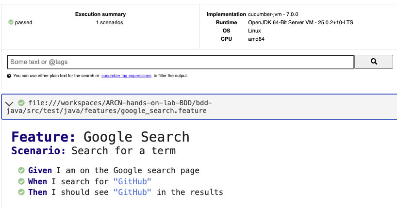

# ARCN Hands-on Lab BDD

Laboratorio base de BDD en Java con Cucumber, Selenium y Maven.

## Objetivo

Implementar y ejecutar un escenario BDD sencillo de busqueda en Google usando:

- Feature Google Search.
- Step definitions con Selenium WebDriver.
- Runner de Cucumber con JUnit.

## Estructura del proyecto

```text
ARCN-hands-on-lab-BDD/
|- README.md
|- .gitignore
|- bdd-java/
	|- pom.xml
	|- src/
		|- main/java/com/eci/arcnbdd/App.java
		|- test/java/
			|- com/eci/arcnbdd/AppTest.java
			|- features/google_search.feature
			|- runners/TestRunner.java
			|- steps/SearchSteps.java
```

## Tecnologias usadas

- Java
- Maven
- JUnit 4
- Cucumber (`cucumber-java`, `cucumber-junit`)
- Selenium WebDriver
- ChromeDriver en modo headless

## Prerrequisitos

- Java instalado y disponible en `PATH`.
- Maven instalado y disponible en `PATH`.
- Google Chrome y ChromeDriver instalados.
- ChromeDriver accesible en `/usr/local/bin/chromedriver`.

Si ChromeDriver esta en otra ruta, actualizar la propiedad en `bdd-java/src/test/java/steps/SearchSteps.java`:

```java
System.setProperty("webdriver.chrome.driver", "/usr/local/bin/chromedriver");
```

## Escenario BDD implementado

Archivo: `bdd-java/src/test/java/features/google_search.feature`

```gherkin
Feature: Google Search

  Scenario: Search for a term
	 Given I am on the Google search page
	 When I search for "GitHub"
	 Then I should see "GitHub" in the results
```

## Ejecucion

Desde la raiz del repositorio:

```bash
cd bdd-java
mvn test
```

## Reportes generados

Al ejecutar `mvn test`, Cucumber genera reportes en `bdd-java/target`:

- `bdd-java/target/JUnitReports/report.xml`
- `bdd-java/target/JSonReports/report.json`
- `bdd-java/target/HtmlReports/report.html`

### Reporte:
[](bdd-java/target/HtmlReports/report.html)

## Autor

Juan Camilo Posso G.
